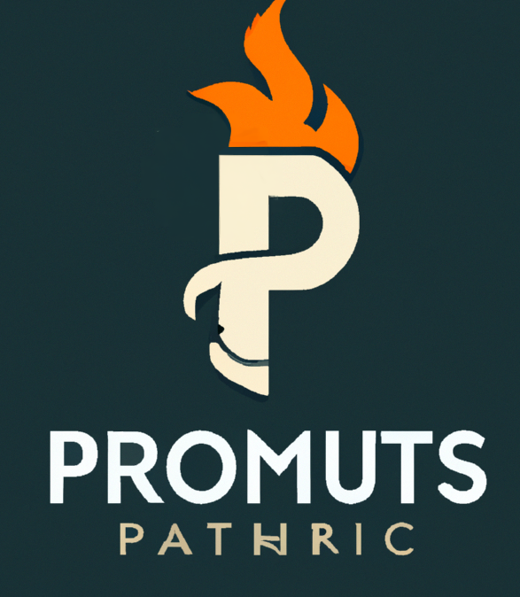
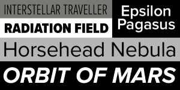
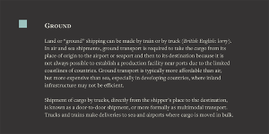

I'm not a web developer (although I have some experience in this area). I'm not a copywriter or a content strategist. I'm not a department head or a comms professional. I'm certainly not a graphic designer. I'm a data guy. I'm fascinated by information, data, and what it can tell us about ourselves and the world. I'm fascinated with how we interact with information, interpret, and connect it. My work has primarily focused on better understanding our response to information and figuring out how we can create more compelling experiences informed by data.

Now, why did I choose to focus this on a university? Well first off, it's the industry I work in and have the most experience with. More than that, however, I wanted to focus on education because I think we're at an inflection point. A lot of trends are converging that will force education to change. AI is only one of them. Social justice, political forces, demographic changes, and diminishing trust are just a few of the questions we will need to solve for in the next years and decades. I want to contribute in a small way to that conversation. I hope that by essentially "fortune telling" higher ed marketing's future that we can start having conversation today that will prepare us for these changes.

So where do we start? Well I'm not really sure. I've never built a university in public before. All I have is a name, Prometheus University. First, let's start creating the foundations of a brand, a mission, and a plan to get this work accomplished.

I asked chatGPT to give me a mission statement. You can read it in full [here](https://docs.google.com/document/d/1uwFLpgho1jz3ZcXHcaPdJnoNPBIiOg1MiXqb2Meifbo/edit?usp=sharing) (I'll put all relevant material in the [google drive folder](https://drive.google.com/drive/folders/1_xggUXeN0k1jAamV5lrZu0YTjCVdh22L?usp=sharing)):

I then asked it what types of documents I would need to start a University. It told me that the foundational elements I would need to create were a mission statement (check), a vision statement, a values statement, governance structure, and policies and procedures. Now as fun (not) as it would be to create a governance structure and policies for my university I decided it might be best for the time being to stick to the identity defining elements of my work. ChatGPT helped me create a vision statement and a values statement.

Next, I moved onto the brand (the fun part). Now, I may be but a lowly analytics dude, but I've been around the smartest brand peeps in higher ed long enough to know that you've got to start with a brand platform. Problem is, I've never actually written one before. I asked chatGPT to give me a template for a brand platform along with an explanation of what should go into it.

Here's what it gave me:

Brand purpose: This is the overarching reason for the university's existence. It should be a clear, compelling statement that reflects the university's mission, vision, and values, and that resonates with its target audience.

*Brand positioning*: This is how the university differentiates itself from other universities and how it positions itself in the minds of its target audience. It should be based on the unique attributes and benefits that the university offers, and should be reflected in its messaging and marketing efforts.

*Brand personality*: This is the set of characteristics that define the university's "voice" and "personality." It should be aligned with the university's culture, values, and target audience, and should be reflected in the university's tone of voice, language, and visual identity.

*Brand messaging*: This is the set of key messages that the university uses to communicate its purpose, positioning, and personality to its target audience. The messaging should be clear, consistent, and compelling, and should be reflected in all of the university's communication channels.

*Brand visuals*: This is the set of visual elements (e.g., logo, colors, typography) that represent the university's brand and that help to establish its visual identity. The visuals should be consistent, distinctive, and aligned with the university's brand personality and messaging.

Then I asked it to begin generating each of these components for me. You can see the full brand platform chatGPT developed [here](https://docs.google.com/document/d/1bvRMXvEVjNA4j1U2qFwTnBEnHqBFar2fMAj4M05n6S0/edit?usp=sharing).

Building the brand platform was my first jaw drop moment. Now again, let me remind you that I am not a brand strategist OR a designer so if anything that follows offends your sensibilities I apologize, but I can say for an amateur I was speechless.

First, a little bit of an admission. I gave Prometheus U a bit of a personality when I began in addition to its name. Here's what I told chatGPT

`"I am starting an elite institution of learning named Prometheus University. Prometheus University is founded on principals of intelligence, equity, innovation, and creativity. It seeks to prepare students for the 21st century. It's a thoroughly modern institution that seeks to push higher education into the future."`

You probably saw these ideas come through in the mission, vision, etc., but they really began to shine in the brand platform. One of chatGPTs undeniable strengths is its ability to repackage information for different use cases. In the brand position it identified "immersive learning experiences and cutting-edge curricula empower our students to become leaders and agents of change in the 21st century" as a differentiator as well as being "thoroughly modern institution that is dedicated to pushing higher education into the future" setting it apart. It's not the most revolutionary thinking out there, but the fact that, as far as I can tell, chatGPT recognized these as key distinctions left me feeling really impressed. Now, mind you there was plenty of your typical filler too ("inclusive and supportive learning environment fosters personal and academic growth, and our values of intelligence, equity, innovation, and creativity inspire our students to reach their full potential as global citizens and lifelong learners"), but nobody's perfect.

Earlier I said that AI currently struggles to create, but is great at pastiche, well the brand platform is a brilliant example of that. ChatGPT will put a premium on brand strategists who know what they're doing because this thing can create your run of the mill platitudes all day.

One of my favorite things chatGPT did was how it developed the brand personality and messaging. It described Prometheus U's brand as

*Bold*: Prometheus University is not afraid to take risks and challenge the status quo. We embrace innovation and creativity, and we encourage our students and faculty to think outside the box and push the boundaries of knowledge.

*Progressive*: Prometheus University is always looking ahead and striving to be at the forefront of higher education. We are dedicated to preparing our students for the 21st century and beyond, and we are constantly evolving and adapting to meet the changing needs of our students and society.

*Inclusive*: Prometheus University is a diverse and welcoming community that values and respects the unique experiences and perspectives of all our students. We believe that education should be accessible and inclusive, and we are committed to creating a learning environment that promotes equity and promotes the success of all our students.

*Inspiring*: Prometheus University is a place where our students and faculty are inspired to reach their full potential and make a positive impact in the world. We believe that education has the power to transform lives and communities, and we are dedicated to creating a vibrant and supportive learning environment that fosters personal and academic growth.

Bookmark this because later on when we get to the brand visuals we're going to come back to this.

The messaging was, again, fine. It adequately translated the brand into a few core ideas:

-   "Empowering the leaders of tomorrow."
-   "Pushing the boundaries of knowledge."
-   "Innovation and creativity at the heart of everything we do."
-   "A thoroughly modern institution for the 21st century."
-   "A supportive and inclusive learning environment."
-   "Advancing knowledge and understanding through research and scholarship."
-   "Inspiring our students to reach their full potential as global citizens and lifelong learners."

Some of them were actually kind of interesting, "pushing the boundaries of knowledge" and "a thoroughly modern institution for the 21st century" felt like they could be interesting. "Advancing knowledge and understanding through research and scholarship" and "Inspiring our students to reach their full potential as global citizens and lifelong learners" maybe not so much.

Ok, but now the moment we've been waiting for - the brand visuals.

Honestly I had no idea what to expect here. I started by asking chatGPT to describe the logo of Prometheus University (I know this is probably the complete opposite way of how you should do this, designers don't "\@" me). You can read what it provided me in the brand platform. Then I asked it to translate the description into a prompt for dall-e I took that and pasted it into dall-e and wow.

Now is it the best, most sophisticated logo ever? No! But for someone as design challenged as me being able to create this felt very exciting. It looks like a school logo. It captures the brand personality. It even generated colors for my school! I tried to get dall-e to clean it up a bit, but found that to be a mostly futile exercise. Regardless, my university was starting to come together.

Lastly, I needed to choose some fonts. Again, here I had no idea what to expect. ChatGPT gave me the following:

A sans-serif font such as Futura, Gotham, or Proxima Nova for headlines and emphasis, to convey a sense of modernity, innovation, and confidence.

(Proxima Nova)

A sans-serif font such as Lato, Open Sans, or Roboto for body copy and longer texts, to convey a sense of inclusivity, approachability, and legibility.

(Lato)

A serif font such as Baskerville, Freight Text, or Merriweather for formal communications and longer documents, to convey a sense of sophistication, intelligence, and prestige.

(Freight Text)

Of all the visuals, this was probably the most impressive to me as a non-designer. Now, I have no clue if any of these options are super gauche or if they're like sooo basic, but the fact that GPT could provide me with a hierarchy of fonts, explanations for how each evokes the brand personality, multiple options, and for them to actually work in their intended applications was truly breathtaking. I've tried picking fonts for professional projects before. It is not fun. I usually break down and enlist the help of my graphic designer sister. As far as I'm concerned, this was one of chatGPT's most impressive accomplishments. It translated the University mission into a brand platform into a personality, into a set of fonts. That's something I could not do without GPT.
